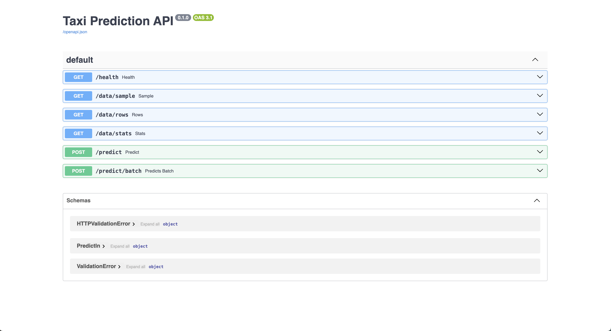
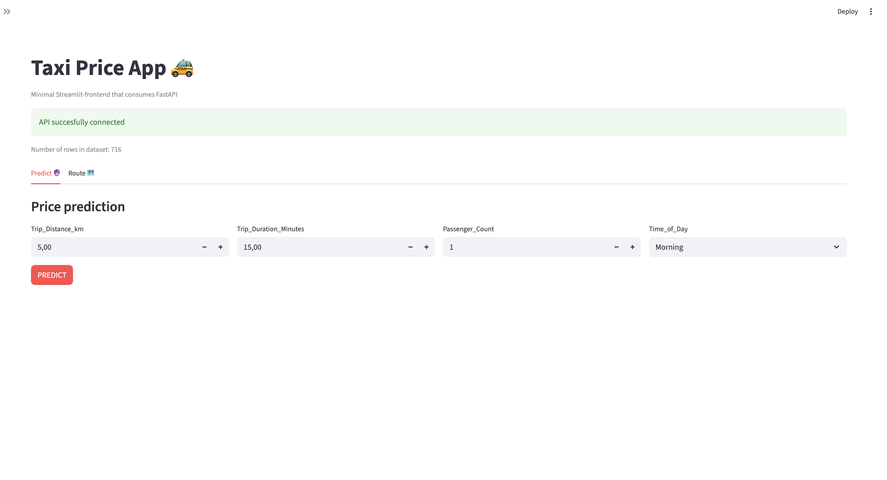
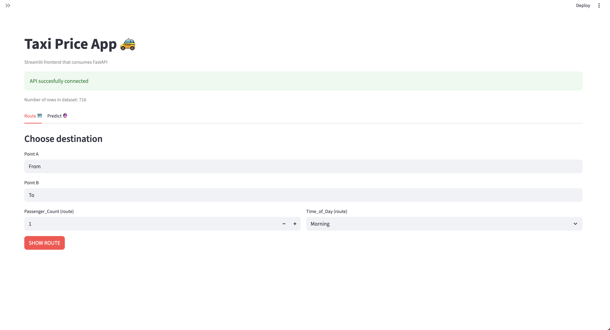
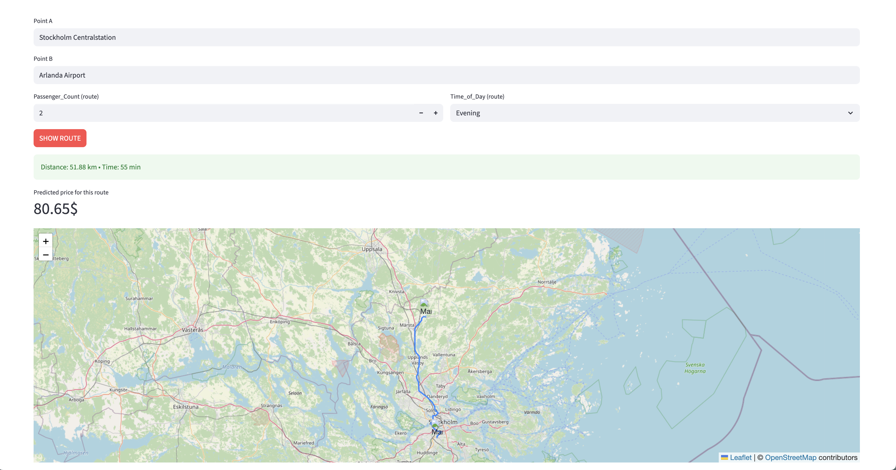

# taxi_prediction_fullstack_kevin
Fullstack ML application for predicting taxi prices

### Swagger UI FastAPI


### Streamlit Taxi prediction


### Insert point A to B




## Project structure 
```
TAXI_PREDICTION_FULLSTACK/
│
├── .venv/                     # Virtual Python-enviroment
│
├── src/
│   └── taxipred/
│       ├── backend/           # Backend-logic and ML-serving
│       │   ├── api.py          # FastAPI-app for predictions
│       │   ├── data_processing.py
│       │   │                   # Datapreprocesing and feature engineering
│       │   └── __pycache__/
│       │
│       ├── frontend/           # Frontend-app
│       │   ├── app.py          # Streamlit-app for user
│       │   ├── .streamlit/
│       │   │   └── secrets.toml    # API-keys and config
│       │   │                  
│       │
│       ├── data/               
│       │   └── taxi_trip_pricing.csv # Raw and cleaned data
│       │
│       ├── model_development/  # Model dev and analysis
│       │   ├── eda.ipynb        # Exploratory Data Analysis
│       │   ├── model_dev.ipynb  # Training and model
│       │   ├── test_model.ipynb # Model testing och validation
│       │   ├── taxi_cleaned_train.csv
│       │   ├── taxi_prediction_input.csv
│       │   └── taxi_price_model.pkl
│       │
│       ├── utils/              
│       │   ├── constants.py    # Constants and global settings
│       │   ├── helpers.py      
│       │   └── __init__.py
│       │
│       └── __init__.py
│
├── README.md                   # Project overview and documentation
├── .gitignore
├── .python-version
├── pyproject.toml              # Project and dependency management
├── uv.lock                     # Locked dependencies
└── __pycache__/
```

## Project overview 
This project is an end-to-end Machine Learning system for predicting taxi fares based on trip data. The project covers the entire ML chain: Exploratory Data Analysis (EDA), model development, backend API and a simple frontend interface for predictions and map visualization. The goal is to show how to go from raw data to a working application that can be used by non technical users. 

## EDA (eda.ipynb)
EDA is used to understand the data before modeling. Focus of the analysis:
- Data quality (missing values, outliers)
- Distribution of the target variable (fare/price)

Relationship between price and: 
- Trip distance
- Trip duration
- Passenger count
- Time of day

The EDA clearly shows that price has a strong linear relationship with distance and that extreme values need to be handled. 

## Model Development (model_dev.ipynb)
This notebook is responsible for the entire model development phase of the porject. The goal is to evaluate different regression models and select a fianl model that balances prediction ability, stability and interprettability. 

Content and workflow
The notebook follows a clear ML workflow:
- Loading preprocessed data
- Feature selection based on EDA insights
- Training multiple regression models
- Evalutation with MAE and RMSE
- Comparisson between models

Model Selection
Linear regression was chosen as the final model because: 
- The relationships in the data are largely linear 
- Performance is comparable to more complex models 
- The risk of overfitting is low 

The final model is trained on the entire training set and saved for use in the backend API. 


## Backend - Data Processing (data_processing.py)
This model is responsible for all data preprocessing required for both training and prediction in production. The purpose is to ensure that the data is processed consistently throughout the lifecycle of the ML system. 

Responsibilities: 
- Input data validation and cleansing
- Transformations required for the models input format
- Isolating the preprocessing in a separate module minimizes the risk of training/production drift and logic duplication. 

Design choices
The Preprocessing is deliberately decoupled from both the notebook and API logic. This makes the code:
- Reusable
- Easiser to test
- Easier to maintain for future model updates

This module is used directly by the API to ensure that each incoming request is processed in an identical manner to the training data. 

## Backend - API (api.py)
Baackend is built with FastAPI.
Why FastAPI:
- High performance
- Automatic documentation (OpenAPI)
- Clear validation of input
- Sutiable for ML models in production

The API:
- Loads the trained model
- Receives trvale data via HTTP
- Runs preprocessing
- Returns price prediction as JSON

The architecture keeps the frontend and model loosely coupled. 

## Frontend - App (app.py)
Frontend is built with Streamlit.
Functionality: 
- User enters parameters
- Data is sent to API
- Predicted price is displayed immediately

ORS (OpenRouteService) is used to: 
- Calculate realistic routes
- Display route geographically

Streamlit was chosen for fast development and clear visualization without heavy frontend development. 

## How to run the project
In the backend for the swagger UI ```uv run uvicorn. api:app --reload```
In the frontend for Streamlit ```uv run streamlit run app.py```